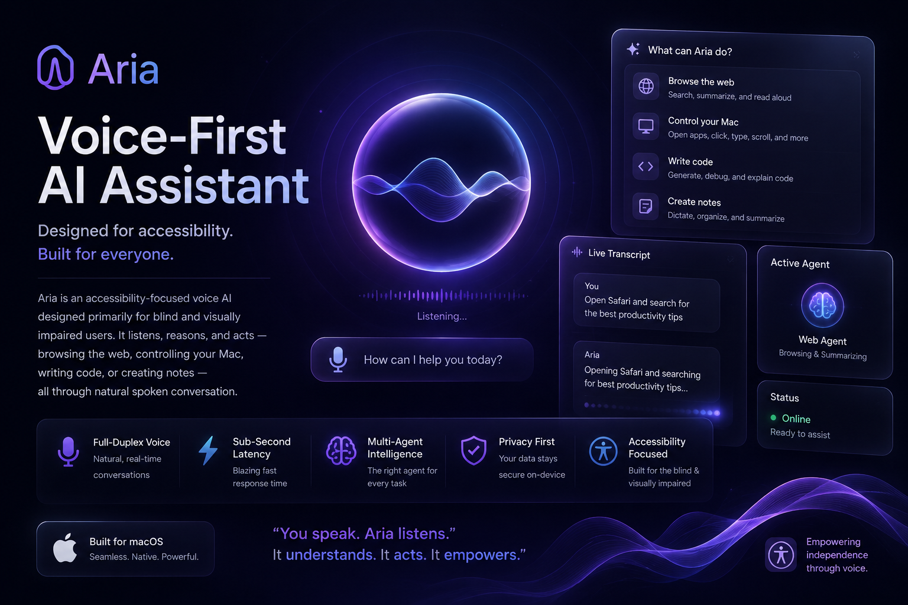

# Aria — Voice-First AI Assistant



Aria is an accessibility-focused voice AI designed primarily for blind and visually impaired users. It listens to your voice, reasons about what you need, and acts — browsing the web, controlling your Mac desktop, writing code, or creating notes — all through natural spoken conversation.

---

## What It Does

Aria is a full-duplex voice agent. You speak, it transcribes your speech in real time, routes your intent to the best specialized AI agent, and speaks back a natural response — all with sub-second latency.

### Specialized Agents

| Agent | What it does |
|---|---|
| **Commerce** | Browses the web, searches for products, compares prices and ratings, and can add items to cart and check out on real e-commerce sites |
| **General** | Navigates any website, reads and summarizes articles, answers factual questions, searches the web |
| **Coding** | Reads, writes, and edits files; runs shell commands; debugs errors; searches the codebase — full developer assistant by voice |
| **Desktop** | Controls your Mac via screenshots + mouse/keyboard using Anthropic's computer-use API — opens apps, clicks buttons, navigates UIs |
| **Documentation** | Creates notes in Apple Notes by controlling the macOS desktop — dictate, it types |

A **LangGraph supervisor** classifies every voice request and routes it to the right agent automatically.

---

## Architecture

```
Microphone → Deepgram STT → Socket.io → LangGraph Supervisor
                                               ↓
                          ┌─────────────────────────────────────┐
                          │  Commerce · General · Coding        │
                          │  Desktop · Documentation            │
                          └─────────────────────────────────────┘
                                               ↓
                               Cartesia TTS → Speaker
```

- **Frontend**: Electron desktop app (React + Vite) with a glassmorphism UI, and a Next.js web client
- **Backend**: Node.js + Express + Socket.io server
- **STT**: Deepgram nova-3 (real-time streaming)
- **TTS**: Cartesia (WebSocket streaming, low latency)
- **LLM**: OpenAI GPT-4o / Anthropic Claude / Ollama (local) — configurable via env vars
- **Agent orchestration**: LangGraph + LangChain
- **Browser automation**: Stagehand
- **Desktop control**: macOS AppleScript + JXA (for the Desktop & Documentation agents)
- **Memory / Knowledge base**: Elasticsearch (user profiles, browsing history, past interactions)
- **AgentVerse**: Python adapter to register Aria as a uAgents-compatible agent

---

## Project Structure

```
aria/
├── server/          # Node.js backend (Express, Socket.io, all agents)
├── client/          # Next.js web frontend
├── electron/        # Electron desktop app
├── visualizer/      # Audio visualizer component
├── agentverse/      # Python uAgents adapter
└── docs/            # Architecture documentation
```

---

## Getting Started

### Prerequisites

- Node.js 18+
- Python 3.10+ (for AgentVerse adapter)
- macOS (Desktop and Documentation agents require macOS)

### Environment Variables

Create `server/.env`:

```env
# LLM — at least one required
OPENAI_API_KEY=
ANTHROPIC_API_KEY=
OLLAMA_MODEL=           # optional: local model name (e.g. llama3)

# Voice
DEEPGRAM_API_KEY=
CARTESIA_API_KEY=
CARTESIA_VOICE_ID=

# Knowledge base (optional)
ELASTIC_CLOUD_ID=
ELASTIC_API_KEY=

# Dev
PORT=3001
TEST=false              # set to true to skip Stagehand + Elasticsearch init
```

### Install & Run

```bash
# Server
cd server && npm install && npm run dev

# Web client
cd client && npm install && npm run dev

# Electron desktop app
cd electron && npm install && npm run dev

# Audio visualizer
cd visualizer && npm run dev:electron

# AgentVerse adapter (Python)
cd agentverse && pip install -r requirements.txt && python register.py
```

---

## Key Features

- **Real-time voice**: Streaming STT + TTS with interim results so the assistant feels instant
- **Multi-agent routing**: LangGraph supervisor classifies intent and picks the right agent — no manual switching
- **Browser control**: Stagehand-powered browser for real shopping, real navigation, real actions
- **Computer use**: Anthropic's computer-use model lets Aria take screenshots and control any macOS app
- **Persistent memory**: Elasticsearch stores user profiles, shopping history, and conversation context
- **Accessibility-first**: Every agent's prompts are tuned for voice output — no markdown, no lists, natural spoken language
- **Graceful degradation**: Works without Elasticsearch or Stagehand if those services are unavailable

---

## Tech Stack

**Frontend**: React, TypeScript, Vite, Electron, Next.js, Tailwind CSS  
**Backend**: Node.js, TypeScript, Express, Socket.io  
**AI**: OpenAI GPT-4o, Anthropic Claude 3, LangGraph, LangChain  
**Voice**: Deepgram (STT), Cartesia (TTS)  
**Automation**: Stagehand, AppleScript, JXA  
**Data**: Elasticsearch  
**Other**: Python, uAgents (Fetch.ai AgentVerse)

